# Everyday

Everyday is app concept which allows you to jot down your daily memories in a simple, elegant yet powerful manner. Jot down memories, get inspired, discover other people's life journeys and much more everyday!.

UI based on: https://www.sketchappsources.com/free-source/2581-everyday-ios-journal-app-sketch-freebie-resource.html

# ScreenShots

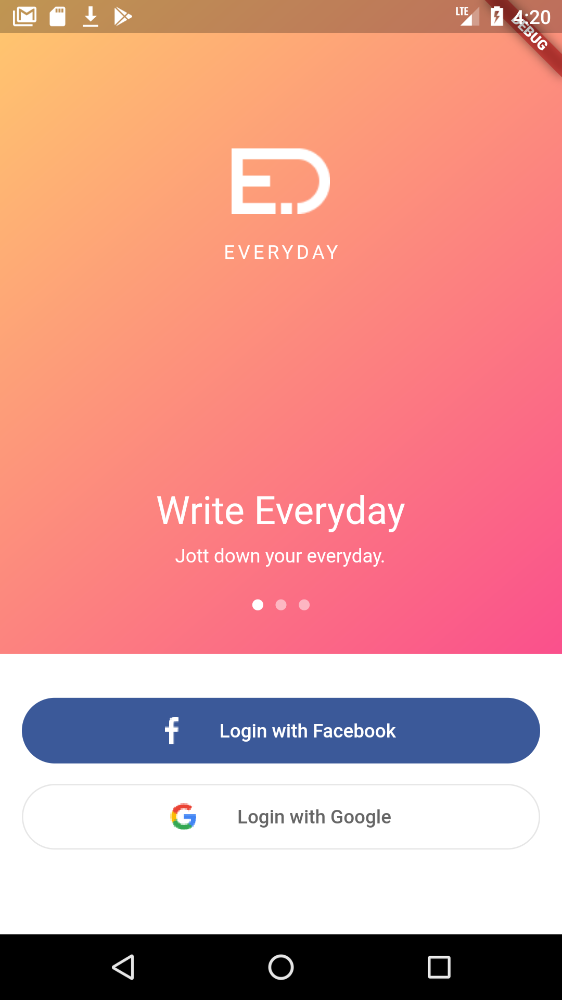 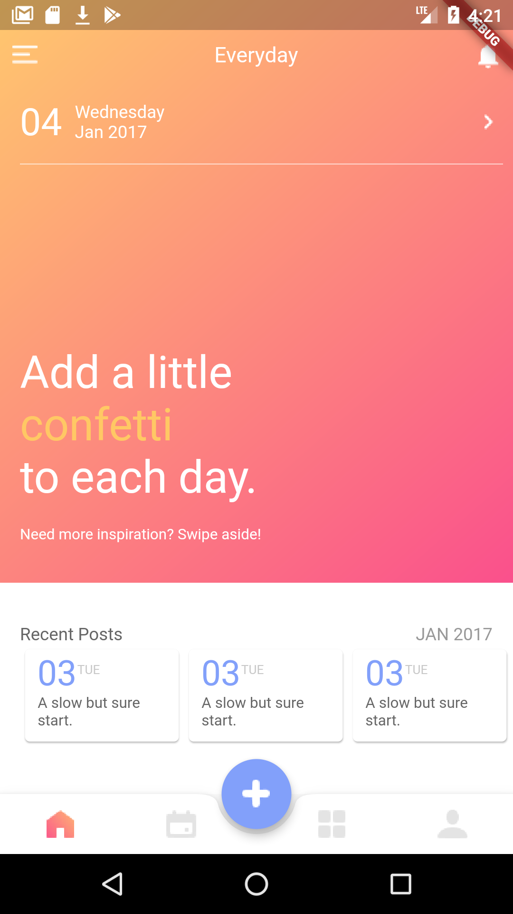 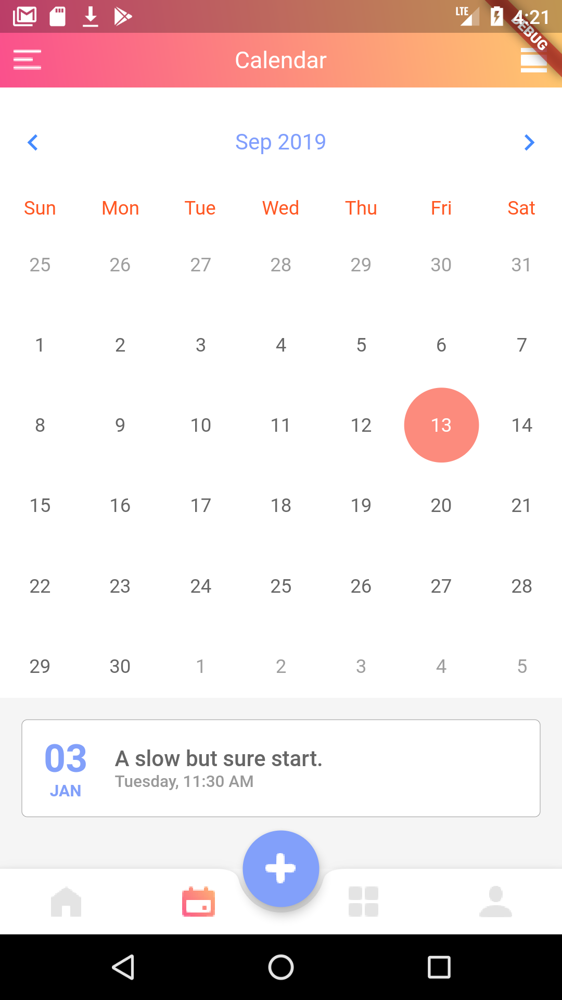 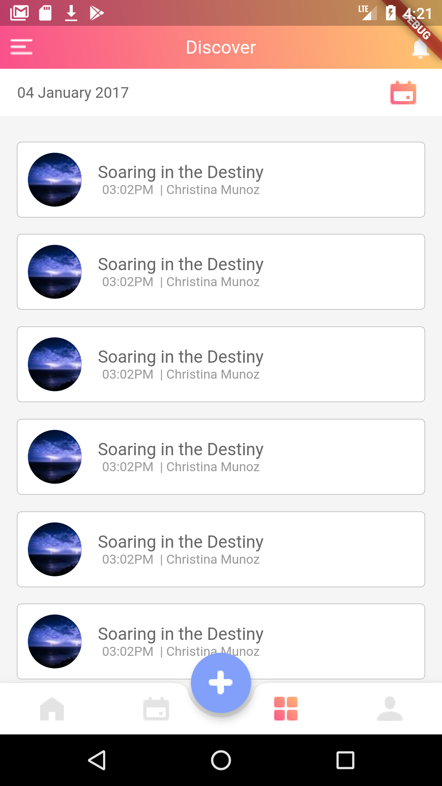  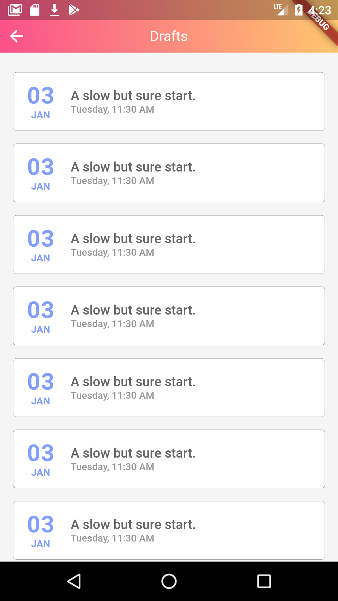  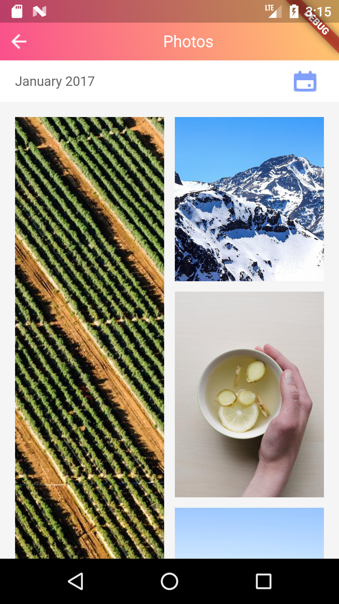 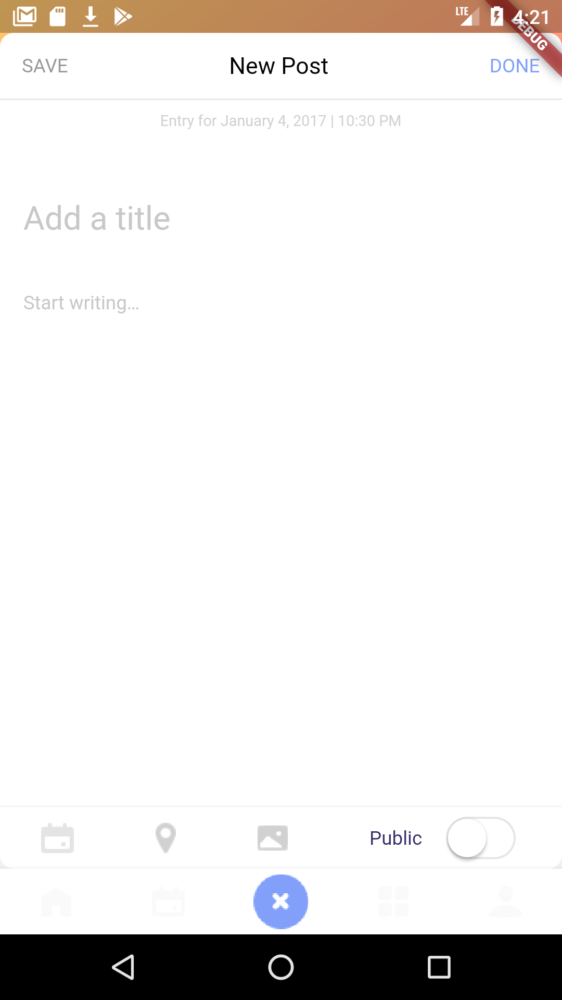 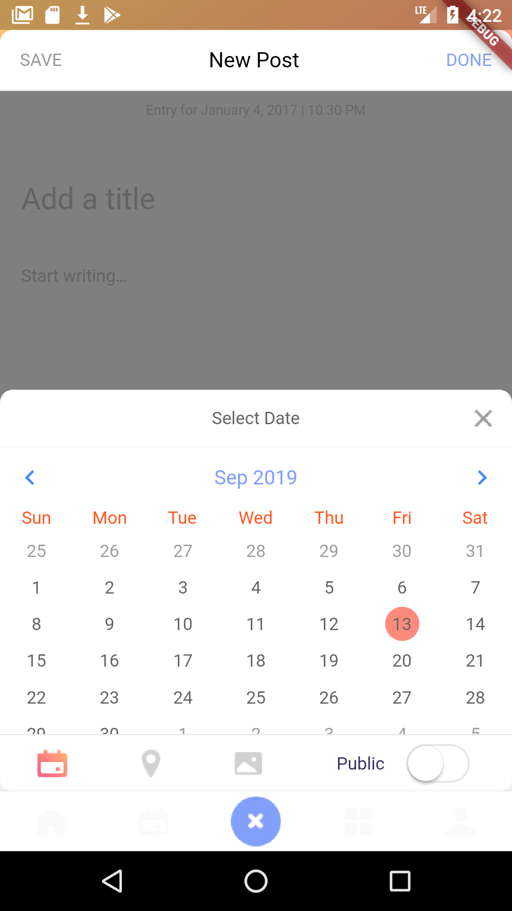 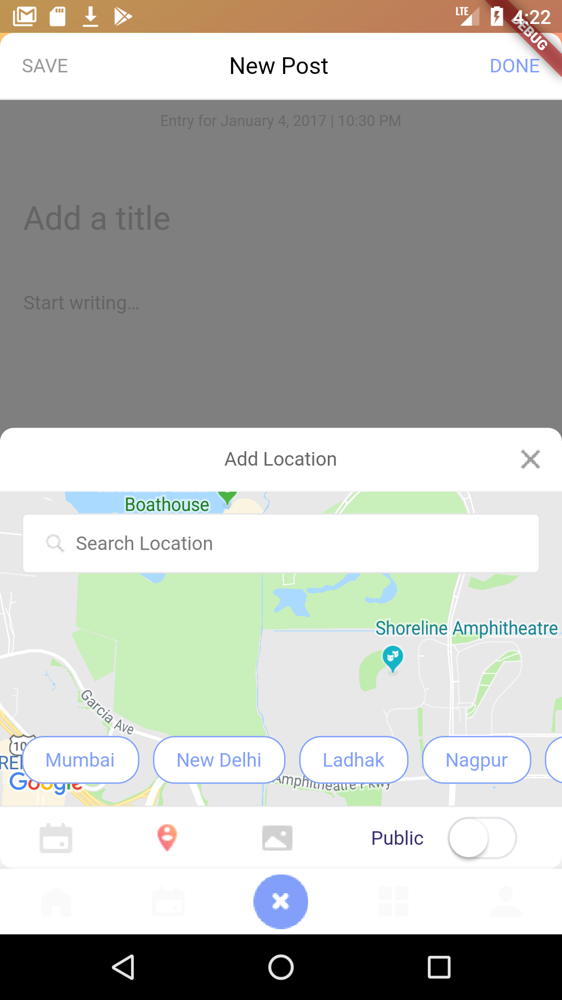 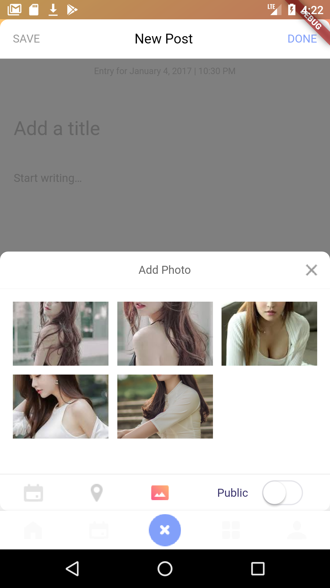 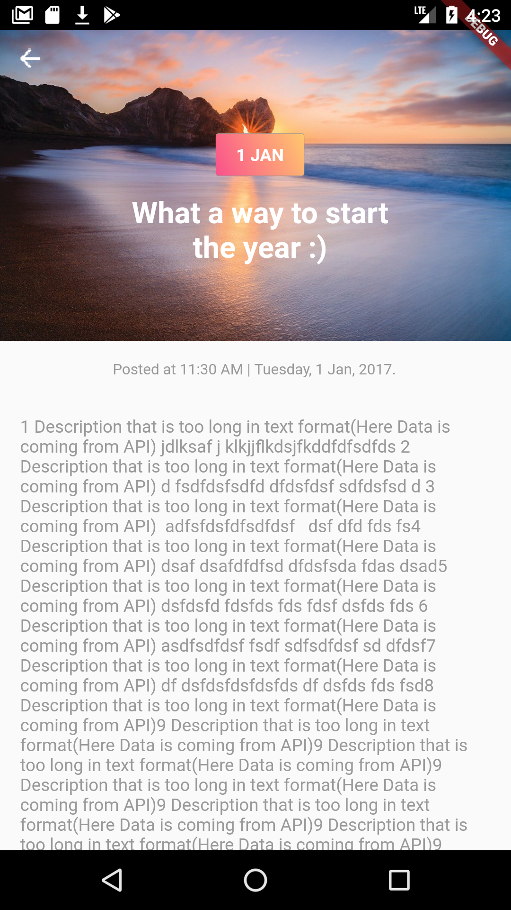
